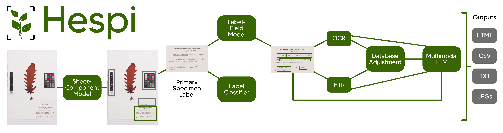

================
Pipeline
================

The Sheet-Component Model
=========================

This model takes specimen sheet images and outputs bounding boxes for 11 components:

#. institutional label
#. data on the specimen sheet outside of a label (‘original data’; often handwritten)
#. taxon and other annotation labels
#. stamps
#. swing tags attached to specimens
#. accession number (when outside the institutional label)
#. small database labels
#. medium database labels
#. full database labels
#. swatch
#. scale

.. image:: images/Sheet-Component-Classes.jpg
    :alt: Component Classes
    :align: center

The Label-Field Model
=====================

The Label-Field Model takes any institutional label detected from the Sheet-Component Model 
and detects bounding boxes for the following fields:

#. family
#. genus
#. species
#. infrasp\_taxon
#. authority
#. collector\_number
#. collector
#. locality
#. geolocation
#. year
#. month
#. day

.. image:: images/Label-Fields-Classes.jpg
    :alt: Field Classes
    :align: center

Label Classifier
================

We have trained a classifier to detect the following types of writing on the institutional label:

#. typewriter
#. printed
#. handwritten
#. combination

.. These were annotated to the 3,152 images from the MELU dataset. 
.. This was partitioned into 2521 training images and 631 validation images. 
.. The pretrained `ResNet-101 model <https://doi.org/10.1109/CVPR.2016.90>`_ model was trained using `torchapp <https://github.com/rbturnbull/torchapp>`_ for 20 epochs on this dataset. 
.. It achieved an accuracy of 98.3% on the validation set.

Text Recognition
================

The text from each field detected from the Label-Field Model is recognized in the Text Recognition module. 
This uses one of two engines. 
If the text was determined to be printed or written using a typewriter, 
then the Text Recognition module uses the `Tesseract <https://github.com/tesseract-ocr/tesseract>`_ Optical Character Recognition (OCR) engine. 
If the text was determined to be hand-written or a mixture, then the `TrOCR <https://www.microsoft.com/en-us/research/publication/trocr-transformer-based-optical-character-recognition-with-pre-trained-models/>`_ Handwritten Text Recognition (HTR) model is used.

Post-processing and Outputs
===========================

After the text for each field is recognized, Hespi performs some postprocessing steps. 
These involve ensuring that the family and genus are capitalized and the species is not. 
The family, genus and species is cross-checked again a database of known entities for each category 
and it chooses the most similar name if it has a higher similarity than 0.8 using the `Gestalt approach <https://www.drdobbs.com/database/pattern-matching-the-gestalt-approach/184407970?pgno=5>`_. 
Hespi then produces a directory of outputs with the predictions of each model which includes CSV, text and cropped image files. To summarize the whole output, it also generates an HTML report which displays the cropped images from each model and the recognized text.
